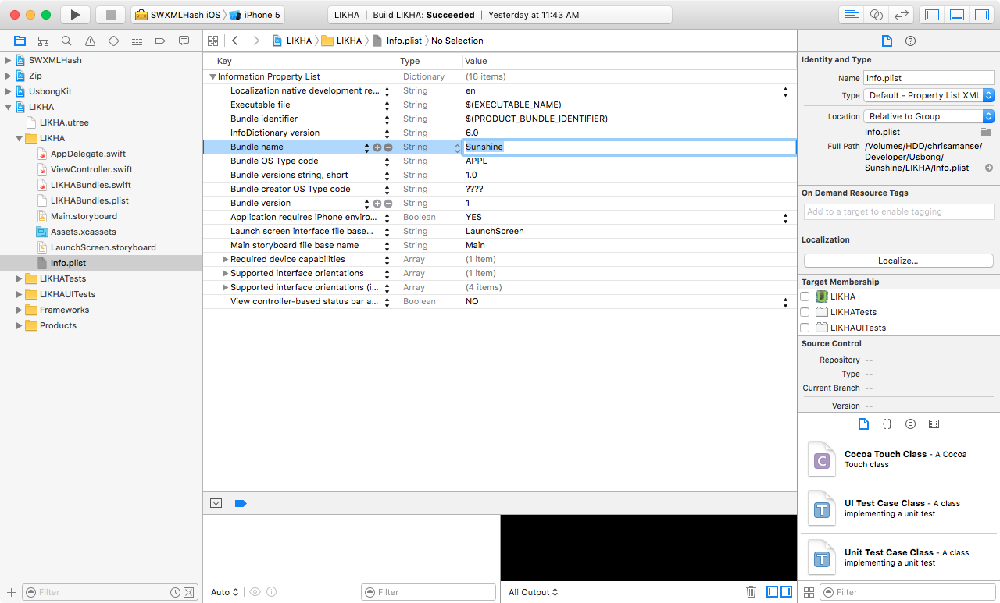
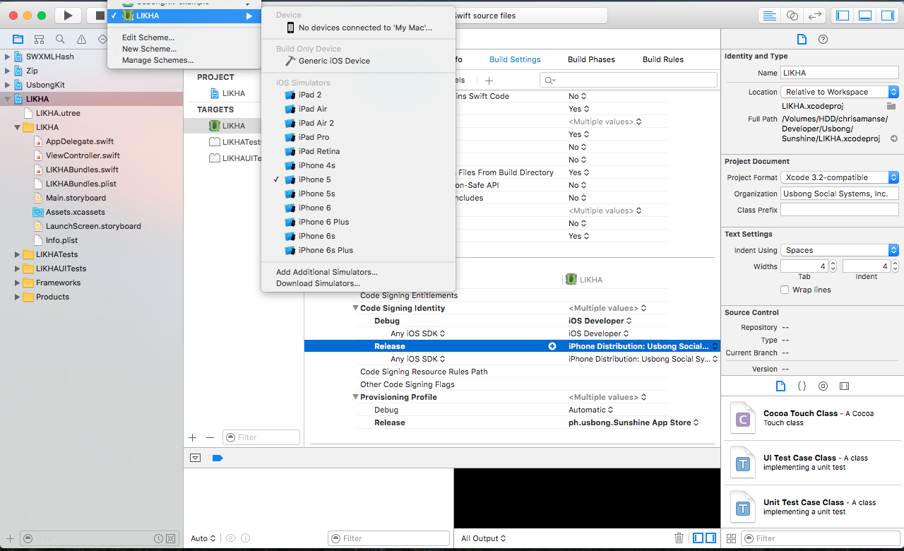

# LIKHA Guide

This is a guide for creating LIKHAs using the LIKHA Xcode project found [here](https://github.com/chrisamanse/LIKHA).

This guide is divided into three parts:

1. [Customizing LIKHA](#1-customizing-likha)
2. [App Store Deployment](#2-app-store-deployment)
3. [In-App Purchases](#3-in-app-purchases)

## Setup

Download the LIKHA repo [here](https://github.com/chrisamanse/LIKHA). To start customizing LIKHA, open the `LIKHA.xcworkspace` using Xcode 7.3.1.

## 1. Customizing LIKHA

1. To use your own utree, simply replace `LIKHA.utree` which is found in the main folder of the repo. It is important to use the same filename for the utree as the app looks for a utree with the filename `LIKHA` and file extension `utree`. If you plan to upload the app in the App Store, you should also replace the Bundle Identifier value found in `LIKHA` using Xcode. If you already have an Apple Developer account set up, you can also select your team there.

  

2. To change the app name displayed below the App Icon in the homescreen, replace the value of "Bundle name" in `Info.plist`.

  
  
3. To customize the About text shown in the About part of the app, edit the contents of `About.txt`.

  

4. You can replace the images found in the app in `Assets.xcassets`. For the App Icon, you need to use image sizes which is defined below each group (29 pt means 29x29 and 2x for 29pt means 58x58, and so on). To quickly generate these images, use an app icon generator such as [Iconizer](http://raphaelhanneken.github.io/iconizer/).

  
  
  

5. To run the app using the simulator, choose "LIKHA" target from the dropdown selection on the right of the Start/Stop buttons found in the top left part of Xcode. You can also choose which type of device to run.

  

## 2. App Store Deployment

## 3. In-App Purchases
